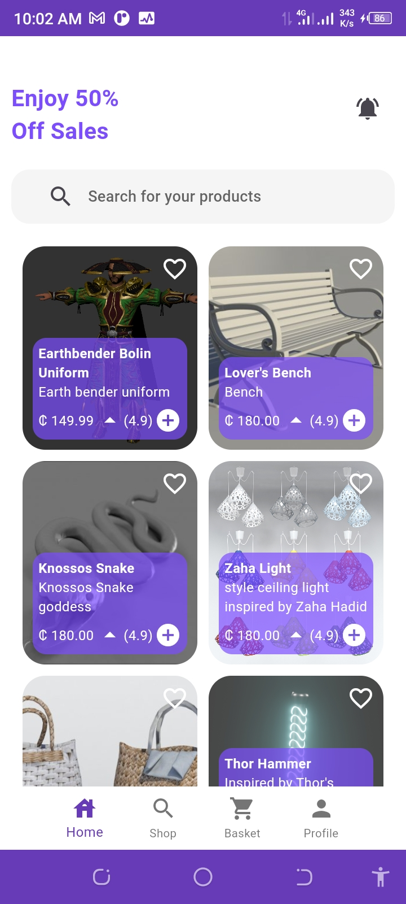
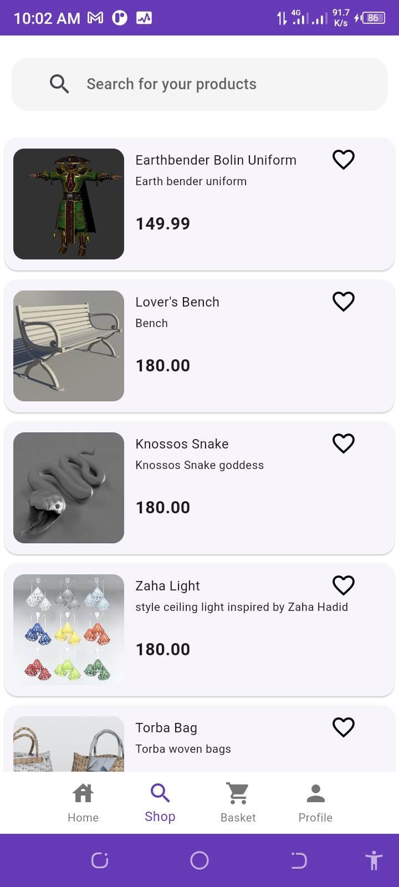
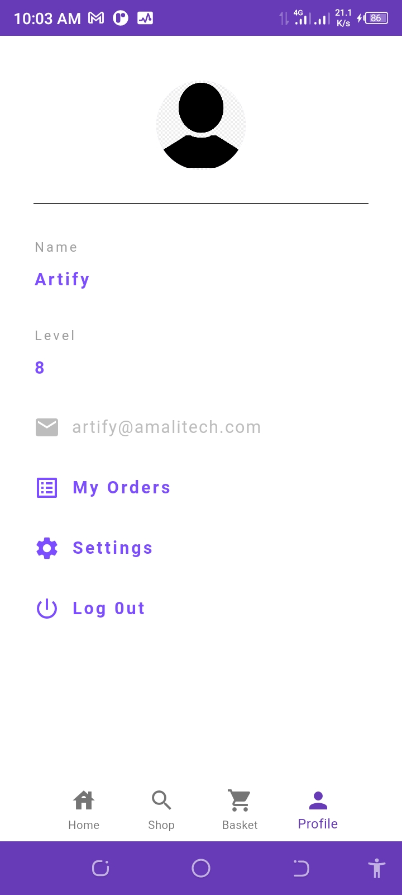
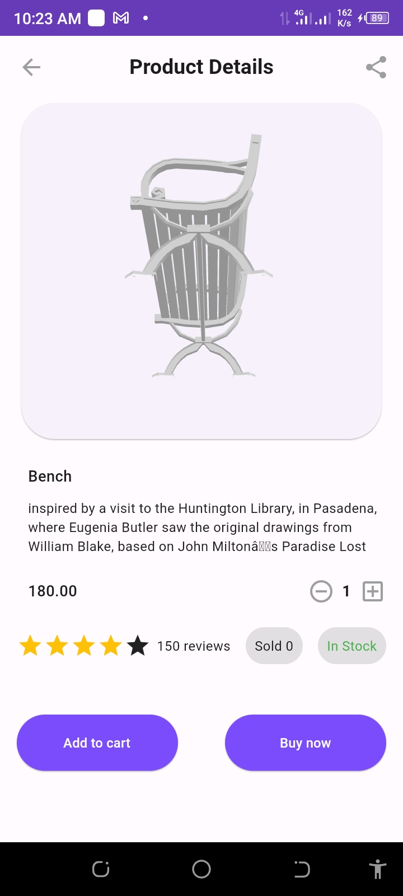
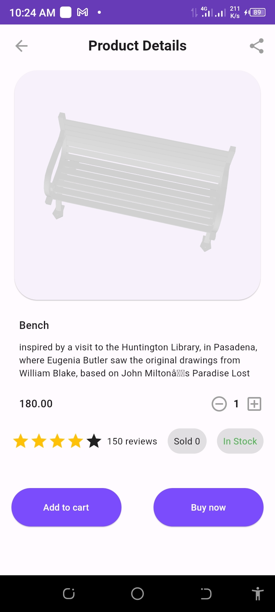
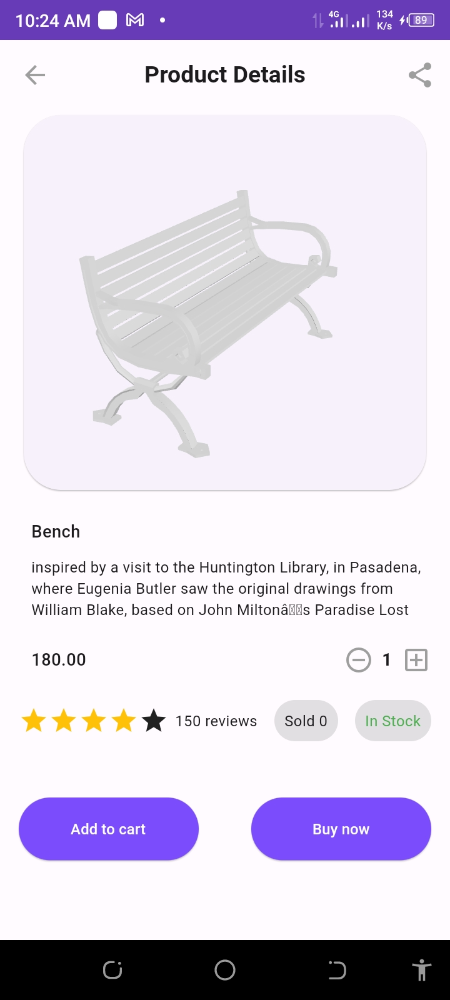

# artify

A new Flutter project.

## Getting Started

A flutter ecommerce Apllication that displays products in 3d

    The project uses an api from django with firebase

    Currently, the 3d is available, some featues like the search and cart are not working.

 Flutter version used is 3.7.12

<table>
    <tr>
        <td></td>
        <td></td>
        <td></td>
    </tr>
    <tr>
        <td></td>
        <td></td>
        <td></td>
    </tr>
    <tr>
        <td></td>
        <td></td>
        <td></td>
    </tr>
</table>